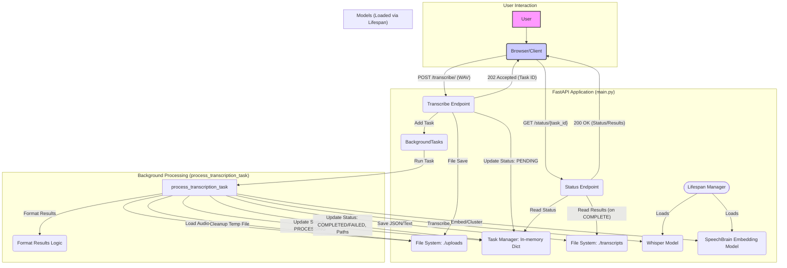

# German WAV Transcriber Web App 🇩🇪🎙️➡️📝

A simple web application built with FastAPI and OpenAI's Whisper to transcribe German `.wav` audio files locally, with optional speaker diarization.

## Features

*   Upload `.wav` files via a simple web interface.
*   **Asynchronous Transcription:** Processes audio in the background, allowing the server to handle other requests.
*   Transcribes audio using a locally run Whisper model (configurable size).
*   **[NEW]** Optionally performs speaker diarization using SpeechBrain to label different speakers.
*   Specifically configured for German language transcription (configurable).
*   **Status Endpoint:** Provides a `/status/{task_id}` endpoint to check the progress and retrieve results.
*   Returns detailed results upon completion, including word-level timestamps, speaker labels (if diarization is successful), and a formatted conversation text.
*   Application behavior is configurable via environment variables (`.env` file).
*   Includes automated tests (using `pytest`) covering the asynchronous API workflow.

## Architecture Overview

The application uses FastAPI for the web framework and follows an asynchronous request-response pattern for transcription tasks.

1.  **Client Interaction:** The user uploads a WAV file via the web interface (served by the root `/` endpoint).
2.  **Transcribe Request:** The browser POSTs the file to the `/transcribe/` endpoint.
3.  **Initial Handling:** FastAPI receives the request.
    *   Validates the file type and checks for necessary dependencies (like `ffmpeg`).
    *   Saves the uploaded file to a temporary location in the configured `UPLOAD_DIR`.
    *   Creates a unique `task_id`.
    *   Stores an initial `PENDING` status for the task in an in-memory dictionary (`tasks`).
    *   Schedules the `process_transcription_task` function to run in the background using `BackgroundTasks`.
    *   Immediately returns a `202 Accepted` response to the client, including the `task_id`.
4.  **Background Processing (`process_transcription_task`):**
    *   Updates the task status to `PROCESSING`.
    *   Loads the temporary audio file.
    *   Performs transcription using the configured Whisper model.
    *   (Optional) Performs speaker diarization using the SpeechBrain embedding model and clustering.
    *   Formats the results (word segments with timestamps, speakers, confidence).
    *   Saves the detailed JSON result to a file in `TRANSCRIPT_DIR`.
    *   Generates and saves a formatted conversation text file to `TRANSCRIPT_DIR`.
    *   Updates the task status to `COMPLETED` (or `FAILED` if an error occurred) and stores the *paths* to the result files in the `tasks` dictionary.
    *   Deletes the temporary uploaded audio file.
5.  **Status Polling:** The client uses the received `task_id` to poll the `/status/{task_id}` GET endpoint.
6.  **Status Response:**
    *   The endpoint checks the in-memory `tasks` dictionary for the given `task_id`.
    *   If the task is `PENDING` or `PROCESSING`, it returns the status and a placeholder message.
    *   If the task is `FAILED`, it returns the status and the stored error message.
    *   If the task is `COMPLETED`, it reads the result JSON file and the conversation text file (using the paths stored in the `tasks` dictionary) and returns the status along with the file contents.

**Diagram:**



**Key Components:**

*   **FastAPI:** Web framework handling requests, responses, and background tasks.
*   **Uvicorn:** ASGI server running the FastAPI application.
*   **Whisper (whisper_timestamped):** Model for audio transcription with word-level timestamps.
*   **SpeechBrain:** Used for speaker embedding extraction required for diarization.
*   **Scikit-learn:** Used for clustering speaker embeddings.
*   **In-Memory Task Dictionary:** Simple state management for background tasks (not persistent).
*   **BackgroundTasks:** FastAPI utility for running tasks after returning a response.
*   **Lifespan Manager:** FastAPI context manager to load ML models on startup and release them on shutdown.

## Testing

The project includes automated tests using `pytest` located in the `tests/` directory. These tests utilize `httpx` for asynchronous API calls and `unittest.mock` for extensive mocking.

**Test Suite (`tests/test_main.py`):**

*   `test_root_endpoint`: Checks if the root `/` endpoint successfully serves the HTML interface (status code 200, correct content type).
*   `test_transcribe_endpoint_success_with_diarization` (**Skipped**): Original synchronous success test, now superseded by the async workflow tests.
*   `test_transcribe_endpoint_save_failure`: Verifies that if saving the initial uploaded WAV file fails (simulated `OSError`), the `/transcribe/` endpoint immediately returns a 500 error *before* starting any background task.
*   `test_transcribe_endpoint_transcript_save_failure` (**Skipped**): Original synchronous test for errors during transcript file saving.
*   `test_transcribe_endpoint_transcription_failure` (**Skipped**): Original synchronous test for errors during the transcription process itself.
*   `test_transcribe_endpoint_diarization_failure` (**Skipped**): Original synchronous test for errors during the diarization process.
*   `test_transcribe_endpoint_ffmpeg_missing`: Ensures that if `ffmpeg` is detected as unavailable (simulated via `app.state`), the `/transcribe/` endpoint immediately returns a 503 error.
*   `test_speechbrain_import_fails`: Attempts to verify graceful handling if `speechbrain` import fails (currently raises `ImportError` as expected, but marked as needing review for the async context).
*   `test_transcribe_async_starts_job`: Checks that POSTing to `/transcribe/` successfully returns a 202 status, the correct response structure (`task_id`, `message`), and that the mocked background task (`mock_process_transcription_task`) is correctly initiated and updates the task status.
*   `test_status_endpoint_workflow`: Tests the complete asynchronous flow by POSTing to `/transcribe/`, then polling the `/status/{task_id}` endpoint until the mocked task reports completion, and finally verifying the structure and content of the successful result returned by the status endpoint.
*   `test_status_endpoint_not_found`: Verifies that requesting status for an unknown `task_id` via `/status/{task_id}` correctly returns a 404 error.

**Mocking Strategy:**

*   The `client` fixture mocks the ML models (`Whisper`, `SpeechBrain`) and other state (`ffmpeg_available`, `device`, paths) within `app.state` to provide a controlled environment for endpoint tests.
*   The `process_transcription_task` function is patched in relevant tests using a mock version (`mock_process_transcription_task`) that simulates different outcomes (processing, success with dummy file creation, failure) and updates the shared `tasks` dictionary.
*   Filesystem operations (`shutil.copyfileobj`, `os.remove`, `os.path.exists`, `builtins.open`, `json.dump`) are patched where necessary to isolate tests from the actual filesystem and simulate I/O errors.

## Prerequisites

Before setting up the Python environment, ensure you have the following installed on your system:

1.  **Python 3.8+:** Check with `python3 --version`.
2.  **`pip` (Python package installer):** Usually comes with Python.
3.  **`venv` (Python virtual environment tool):** Usually comes with Python.
4.  **`ffmpeg`:** This is a crucial dependency for Whisper to process audio files. Installation methods vary by OS:
    *   **Debian/Ubuntu:** `sudo apt update && sudo apt install ffmpeg`
    *   **Fedora:** `sudo dnf install ffmpeg`
    *   **macOS (using Homebrew):** `brew install ffmpeg`
    *   **Windows:** Download from the official ffmpeg website or use a package manager like Chocolatey (`choco install ffmpeg`).
    *   Verify installation with `ffmpeg -version`.
5.  **`rustc` (Rust compiler):** May be required during the installation of the `tokenizers` dependency (part of `openai-whisper`). If `pip install` fails related to `tokenizers`, install Rust from <https://rustup.rs/>.
6.  **[NEW] PyTorch:** Required by both Whisper and SpeechBrain. `pip install -r requirements.txt` should handle this. Ensure you have a compatible version, especially if using a GPU (install the CUDA version if applicable). See <https://pytorch.org/>.
7.  **[NEW] (Optional but Recommended for Diarization) Git LFS:** SpeechBrain might use Git LFS to download model files. Install it if you encounter download issues related to LFS during the first run: <https://git-lfs.com/>.

## Setup & Installation

1.  **Clone the repository (or place the files in a directory):**
    ```bash
    # git clone <repository_url> # If applicable
    cd <your_project_directory>
    ```

2.  **Create and activate a Python virtual environment:**
    ```bash
    # Use python3 if python is not linked
    python3 -m venv venv
    source venv/bin/activate  # Linux/macOS
    # venv\Scripts\activate  # Windows Command Prompt
    # .\venv\Scripts\Activate.ps1 # Windows PowerShell
    ```

3.  **Install Python dependencies:**
    ```bash
    pip install -r requirements.txt
    ```
    *(This step downloads FastAPI, Uvicorn, Whisper, SpeechBrain, PyTorch, etc. It may take some time, especially for the large ML libraries and their dependencies).* 

4.  **Configure Environment Variables:**
    *   Copy the example environment file:
        ```bash
        cp .env_example .env
        ```
    *   Edit the `.env` file. See the Configuration section below for details.

## Configuration (`.env` file)

Modify the `.env` file to control the application's behavior:

*   `WHISPER_MODEL_SIZE`: Specifies the Whisper model to use (e.g., `tiny`, `base`, `small`, `medium`, `large`). Smaller models are faster and use less memory but are less accurate. Larger models are more accurate but require more resources (RAM, potentially GPU) and take longer. Defaults to `base`.
*   `SUPPORTED_LANGUAGE`: The language Whisper should expect. Defaults to `german`.
*   `UPLOAD_DIR`: The directory where temporary uploaded `.wav` files are stored before transcription. Defaults to `./uploads`.
*   `TRANSCRIPT_DIR`: The directory where the final `.txt` transcript files are saved. Defaults to `./transcripts`.
*   `HOST`: The IP address the development server binds to (e.g., `127.0.0.1` for local access only, `0.0.0.0` to be accessible on your network). Defaults to `127.0.0.1`.
*   `PORT`: The port the development server listens on. Defaults to `8000`.

*Security Note:* Ensure `UPLOAD_DIR` and `TRANSCRIPT_DIR` are secure locations and the application is not exposed to untrusted networks if using `HOST=0.0.0.0`.
*Model Caching:* Both Whisper and SpeechBrain models will be downloaded and cached locally (typically in `~/.cache/torch/` or within the project under `pretrained_models/`) on their first use.

## Running the Application

1.  **Ensure your virtual environment is activated.** (`source venv/bin/activate`)
2.  **Start the FastAPI development server:**
    ```bash
    # Recommended: Use the restart script for clean state
    ./restart_server.sh 
    # Or manually:
    # uvicorn main:app --reload --host $(grep -E \'^HOST=\' .env | cut -d \'=\' -f2 || echo \'127.0.0.1\') --port $(grep -E \'^PORT=\' .env | cut -d \'=\' -f2 || echo \'8000\')
    ```
    *   The `restart_server.sh` script helps kill old processes and clear temporary files.
    *   The server address (e.g., `http://127.0.0.1:8000`) will be shown in the terminal.
    *   **First Run:** The first time you run the app, Whisper and SpeechBrain will download their specified models. This download can take time.

3.  **Access the Web Interface:**
    *   Open your web browser and navigate to the address shown by Uvicorn (e.g., `http://127.0.0.1:8000`).

4.  **Upload and Check Status (New Workflow):**
    *   Use the form to select a German `.wav` file.
    *   Click "Transcribe".
    *   The server will immediately respond with `202 Accepted` and a JSON message containing a `task_id` (e.g., `{"task_id":"some-uuid-string", "message":"File upload accepted, processing started."}`).
    *   **Polling:** You need to periodically check the `/status/{task_id}` endpoint (replace `{task_id}` with the actual ID received) to monitor progress.
        *   Example (using `curl`):
          ```bash
          # Initial check (might show PENDING or PROCESSING)
          curl http://127.0.0.1:8000/status/some-uuid-string
          
          # Keep polling until status is COMPLETED or FAILED
          ```
    *   **Transcription and diarization still occur in the background and can take significant time.**

5.  **Retrieve Results:**
    *   When polling `/status/{task_id}` shows `"status": "COMPLETED"`, the response will contain the transcription results.
    *   **Successful Response Structure:**
        ```json
        {
          "task_id": "some-uuid-string",
          "status": "COMPLETED",
          "result": [
            {
              "start": 0.5,
              "end": 1.2,
              "text": "Hallo",
              "speaker": "SPEAKER_00",
              "confidence": 0.95
            },
            // ... more word segments
          ],
          "conversation_text": "[00:00] SPEAKER_00: Hallo Welt.\n[00:03] SPEAKER_01: Dies ist ein Test."
        }
        ```
        *   `result`: A list of dictionaries, each representing a transcribed word with timestamps, text, assigned speaker label, and confidence score.
        *   `conversation_text`: A formatted string presenting the conversation with timestamps and speakers, suitable for direct display.
    *   If the status is `"FAILED"`, the `result` field will contain an error message.
    *   While processing, the `result` field will typically contain the string `"Processing is ongoing."`. 

## Running with Docker (Alternative)

This project includes a `Dockerfile` to build and run the application in a container. This is useful for creating a consistent environment.

**Prerequisites:**

*   Docker installed and running on your system.

**Building the Docker Image:**

1.  Navigate to the project's root directory (where the `Dockerfile` is located).
2.  Run the build command:
    ```bash
    docker build -t german-transcriber-app .
    ```
    *   This will download the base image, install dependencies (including `ffmpeg` and Python packages), and copy the application code into the image.
    *   The first build might take a while due to downloads and installations.

**Running the Docker Container:**

1.  **Create directories for uploads and transcripts on your host machine:** These will be mounted into the container so that the files persist even if the container is removed.
    ```bash
    mkdir -p ./host_uploads
    mkdir -p ./host_transcripts
    ```

2.  **Run the container, mounting the volumes and passing the `.env` file:**
    ```bash
    docker run -d --rm \
      -p 8000:8000 \
      --env-file .env \
      -v $(pwd)/host_uploads:/app/uploads \
      -v $(pwd)/host_transcripts:/app/transcripts \
      --name german-transcriber \
      german-transcriber-app
    ```
    *   `-d`: Run in detached mode (in the background).
    *   `--rm`: Automatically remove the container when it stops.
    *   `-p 8000:8000`: Map port 8000 on your host to port 8000 in the container.
    *   `--env-file .env`: Pass the environment variables from your local `.env` file to the container. **Important:** Ensure your `.env` file exists and is configured correctly *before* running this command.
    *   `-v $(pwd)/host_uploads:/app/uploads`: Mount the `host_uploads` directory on your host to `/app/uploads` inside the container (adjust path if needed).
    *   `-v $(pwd)/host_transcripts:/app/transcripts`: Mount the `host_transcripts` directory to `/app/transcripts`.
    *   `--name german-transcriber`: Assign a name to the container for easier management.
    *   `german-transcriber-app`: The name of the image built previously.

3.  **Access the Web Interface:**
    *   Open your browser and navigate to `http://localhost:8000` (or the host IP if Docker is running remotely).

4.  **Check Transcripts:**
    *   Uploaded files will appear temporarily inside the container's `/app/uploads` (and thus in your `host_uploads` directory).
    *   Completed transcripts will be saved to `/app/transcripts` inside the container (and thus in your `host_transcripts` directory).

5.  **View Logs:**
    ```bash
    docker logs german-transcriber
    ```

6.  **Stop the Container:**
    ```bash
    docker stop german-transcriber
    ```

## Running Tests

This project includes automated tests using `pytest`.

1.  **Ensure the virtual environment is activated and dev dependencies are installed.** (`pip install -r requirements.txt`)
2.  **Run tests:**
    ```bash
    python -m pytest -v tests/test_main.py
    ```
    *   The tests cover the `/` (root), `/transcribe/`, and `/status/{task_id}` API endpoints.
    *   **Mocking:** Tests use `unittest.mock` extensively to:
        *   Prevent actual model loading.
        *   Prevent actual file I/O.
        *   **Simulate the asynchronous workflow:** Mock the background task function (`process_transcription_task`) to control its outcome (success/failure) and use `asyncio.sleep` to test the polling of the `/status/{task_id}` endpoint.
        *   Test various scenarios like successful transcription, dependency checks (ffmpeg), file saving errors, and task status reporting.
        *   The `client` fixture manually sets the application state (`app.state`) for endpoint tests.

## Notes & Potential Improvements

*   **Performance:** Transcription and diarization are CPU/GPU intensive. Consider using smaller models (`tiny`, `base`) for faster results on less powerful machines. GPU acceleration significantly speeds up Whisper and potentially SpeechBrain if available and PyTorch is installed with CUDA support.
*   **[NEW] Diarization Accuracy:** Speaker diarization quality depends heavily on the audio characteristics (clarity, speaker overlap, noise) and the chosen model. The current setup uses a standard VoxCeleb-trained model; results may vary. Tuning diarization hyperparameters (if exposed) or using different models might be necessary for specific use cases.
*   **Error Handling:** Basic error handling is in place. Check the terminal where `uvicorn` is running for detailed logs and error messages.
*   **File Type Validation:** The application currently only logs a warning for some non-`.wav` content types. Stricter validation could be added in `main.py`.
*   **Asynchronous Processing:** The application now uses `FastAPI Background Tasks` to perform the heavy transcription/diarization work off the main request thread, improving responsiveness.
*   **Scalability:** This setup is intended for local/single-user operation. For higher concurrency, consider a more robust task queue system (e.g., Celery with Redis/RabbitMQ) instead of the in-memory `tasks` dictionary and `BackgroundTasks`.
*   **Result Storage:** Currently, results are linked via an in-memory dictionary. For persistence across server restarts, results (or at least the file paths) would need to be stored in a database or more permanent storage. 